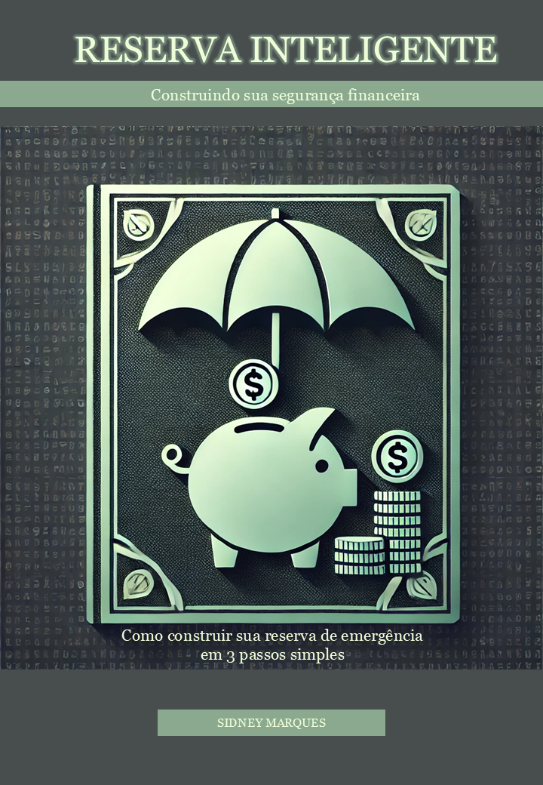

    

-------

# Projeto EBOOK Gerado por IAs

 > ℹ️ **NOTE:** Este é o repositório desenvolvido durante o curso no qual fui instrutor técnico na plataforma da [DIO](https://dio.me)

Projeto com o objetivo de gerar um ebook digital com as facilidades das ferramentas de IA. todos os prompts
seguem abaixo.

📕<a href="https://github.com/sidneymvn/prompts-recipe-to-create-a-ebook/blob/main/output/ebook%20Reserva%20Inteligente.pdf" title="View PDF now">Clique aqui para ler</a>

## 💻 Tecnologias utilizadas no projeto

- [ChatGPT](https://chat.openai.com/) 
- [DALL-E](https://openai.com/index/dall-e/)
- [PowerPoint](https://www.microsoft.com/en/microsoft-365/powerpoint)

## 🧠 Prompts

ChatGPT：

|   Ação   | prompt                                                                                                                                                                                                                                                                     |
| :------: | ------------------------------------------------------------------------------------------------------------------------------------------------------------------------------------------------------------------------------------------------------------------------------ |
|  título  | crie um título para um ebook sobre o tema de "como iniciar em investimentos". o nicho é educação financeira. subnicho é reserva de emergência. o título deve ser épico, curto, ter uma temática de "Benjamin Graham". Liste 5 variações de títulos. |
|capa | cite 5 ideias de capa para este ebook |
|conteúdo | crie um texto para ebook, com foco em "como criar sua reserva de emergência", listando 3 passos simples {REGRAS} > explique sempre de uma maneira simples > deixe o texto enxuto > sempre traga exemplos com contextos reais > sempre deixe um título sugestivo por tópico| 

DALL-E：

|  Ação  | prompt                                                                                 |
| :----: | -------------------------------------------------------------------------------------- |
| título | crie uma imagem no seguinte estilo: Fundo liso em tons pastéis (azul ou verde claro) para uma aparência acessível. Ícones financeiros como moedas, notas, cofrinhos e gráficos organizados em mosaico. O título grande e central com um subtítulo explicativo.|
| ilustração | crie a imagem de um porquinho-cofrinho, bem bonitinho
| ilustração | crie a imagem de um porquinho inteligente
| ilustração | crie a imagem de um porquinho-cofrinho rico

## ✨ Features

- Conteúdo gerado via ChatGPT
- Imagens geradas via DALL-E

## 📚 Materiais

- Imagens utilizadas em `assets`
- ebook gerado durante as aulas em `output`

---

criado por [Sidney Marques](https://github.com/sidneymvn)
